<!--
  ╔══════════════════════════════════════════════════════════════╗
  ║  SUBSTITUA ANTES DE PUBLICAR:                                ║
  ║  SEU_USUARIO  → seu username do GitHub                       ║
  ║  SEU NOME     → seu nome (também no assets/banner.svg)       ║
  ║  links de redes sociais, e-mail e repositórios dos projetos  ║
  ╚══════════════════════════════════════════════════════════════╝
-->

<div align="center">



<br/>


<br/>

<a href="https://github.com/GustavoBarbosaDev">
  
</a>

<br/><br/>


<br/>


</div>

<br/>


## `> whoami`

```python
class Developer:
    def __init__(self):
        self.name      = "Gustavo Barbosa"
        self.role      = "Backend Developer"
        self.language  = "Python"
        self.location  = "Brasil"
        self.focus     = ["APIs REST", "Python", "Banco de dados"]
        self.mindset   = "Código simples e testável"

    def __repr__(self):
        return "Transformando requisitos em sistemas confiáveis."
```

### 🧠 Sobre Mim

Sou **Programador Backend** trabalhando com **Python**, construindo APIs e integrando sistemas. Gosto de código limpo, testes automatizados e de aprender coisas novas.

-  Estudando **boas práticas** e **testes**
-  Aprendendo sobre **Docker** e **banco de dados**
-  Aberto a **colaborações** e projetos open source


## `> cat tech_stack.json`

<div align="center">

### Linguagens & Frameworks


### Bancos de Dados


</div>


## `> git log --projects --featured`

<div align="center">

<table>
<tr>
<td align="center" width="50%">
<a href="https://github.com/GustavoBarbosaDev/projeto-1">

</a>
</td>
<td align="center" width="50%">
<a href="https://github.com/GustavoBarbosaDev/projeto-2">

</a>
</td>
</tr>
<tr>
<td align="center" width="50%">
<a href="https://github.com/GustavoBarbosaDev/projeto-3">

</a>
</td>
<td align="center" width="50%">
<a href="https://github.com/GustavoBarbosaDev/projeto-4">

</a>
</td>
</tr>
</table>

</div>


## `> cat ~/goals.sh`

```bash
#!/usr/bin/env bash
# Objetivos atuais

[ ✔ ] Python e APIs REST ..................... 100%
[ ▶ ] FastAPI e Django ....................... 80%
[ ▶ ] Banco de dados PostgreSQL .............. 70%
[ ▶ ] Docker básico .......................... 60%
[ ⏳ ] Testes automatizados ................... 40%
[ ⏳ ] Git e GitHub .......................... 50%
```


## `> ./github_stats --live`

<div align="center">

<a href="https://github.com/GustavoBarbosaDev">
  
</a>
<a href="https://github.com/GustavoBarbosaDev?tab=repositories">
  
</a>

</div>


## `> ping -c 1 contact`

<div align="center">

<a href="https://www.linkedin.com/in/gustavobarbosadev" target="_blank">
  
</a>
<a href="mailto:barbosagustavo.dev@gmail.com" target="_blank">
  
</a>

<br/><br/>

```text
┌─────────────────────────────────────────────┐
│    STATUS: aberto a novas oportunidades     │
│    RESPOSTA: geralmente em até 24h          │
└─────────────────────────────────────────────┘
```

</div>

<br/>

<div align="center">


<sub>© 2026 Gustavo Barbosa· Todos os sistemas operacionais </sub>

</div>
