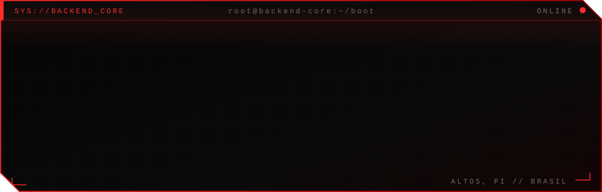
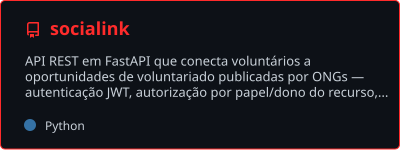
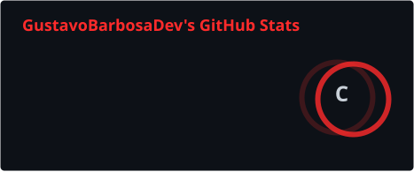
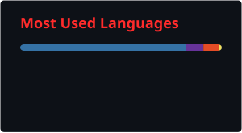

<div align="center">



<br/>

<a href="https://github.com/GustavoBarbosaDev">
  
</a>

<br/><br/>


<a href="https://portifolio-tau-umber-38.vercel.app/"></a>

<br/>


</div>

<br/>

## `> whoami`

```python
class Developer:
    def __init__(self):
        self.name      = "Gustavo Barbosa"
        self.role      = "Backend Developer (Python)"
        self.location  = "Altos, PI, Brasil"
        self.education = "Engenharia de Software @ ICEV (6º semestre)"
        self.focus     = ["Autenticação", "Testes automatizados", "CI/CD"]
```

### Sobre Mim

Sou desenvolvedor backend júnior e trabalho com APIs REST em Python. Comecei na Física (UFPI), cheguei à programação por uma pesquisa sobre teoria do caos e hoje curso Engenharia de Software.

No dia a dia uso FastAPI, SQLModel e PostgreSQL, com pytest e GitHub Actions para testes e CI. Me interesso principalmente por autenticação, testes e deploy. O [Socialink](https://github.com/GustavoBarbosaDev/socialink) é o projeto onde apliquei isso de ponta a ponta, e os detalhes estão no [portfólio](https://portifolio-tau-umber-38.vercel.app/).

## `> cat tech_stack.json`

<div align="center">

### Dia a dia


<sub><b>Qualidade:</b> pytest · ruff · mypy &nbsp;|&nbsp; <b>ORM:</b> SQLModel · SQLAlchemy</sub>

### Também já usei


</div>

## `> git log --projects --featured`

<div align="center">

<a href="https://github.com/GustavoBarbosaDev/socialink">

</a>

Socialink: API REST para ONGs gerenciarem vagas de voluntariado, com autenticação JWT e fluxo de candidaturas. 113 testes, 100% de cobertura.

[Estudo de caso](https://portifolio-tau-umber-38.vercel.app/projetos/socialink) · [Código](https://github.com/GustavoBarbosaDev/socialink) · [Demo](https://socialink-gilt.vercel.app)

<table>
<tr>
<td align="center" width="50%">
<a href="https://github.com/GustavoBarbosaDev/hora-cravada">

</a>
</td>
<td align="center" width="50%">
<a href="https://github.com/GustavoBarbosaDev/qa_forge">

</a>
</td>
</tr>
</table>

</div>

## `> cat ~/learning.md`

- AWS Cloud Foundations (em andamento)
- Engenharia de Software no ICEV (6º semestre)
- Linux Essentials (concluído)

## `> ./github_stats --live`

<div align="center">

<a href="https://github.com/GustavoBarbosaDev">
  
</a>
<a href="https://github.com/GustavoBarbosaDev?tab=repositories">
  
</a>

</div>

## `> ./snake --eat contributions`

<div align="center">

<picture>
  <source media="(prefers-color-scheme: dark)" srcset="https://raw.githubusercontent.com/GustavoBarbosaDev/GustavoBarbosaDev/output/github-snake-dark.svg" />
  <source media="(prefers-color-scheme: light)" srcset="https://raw.githubusercontent.com/GustavoBarbosaDev/GustavoBarbosaDev/output/github-snake.svg" />
  
</picture>

</div>

## `> ping -c 1 contact`

<div align="center">

<a href="https://www.linkedin.com/in/gustavobarbosadev" target="_blank">
  
</a>
<a href="https://portifolio-tau-umber-38.vercel.app/" target="_blank">
  
</a>
<a href="mailto:barbosagustavo.dev@gmail.com" target="_blank">
  
</a>

<br/><br/>

Aberto a oportunidades CLT ou PJ, remoto ou presencial.

</div>

<br/>

<div align="center">


</div>
